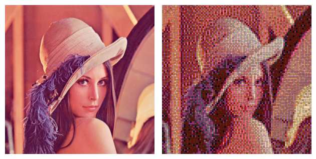

# LEGO Mosaic Generator

A Python-based pipeline that transforms any image into a LEGO-style mosaic using color quantization, dithering, and tile placement logic.

This is a passion project inspired by a friend and my insatable knowledge for learning new dithering algorithms, feel free to expand the project and add new methods.




---

## Features

- Convert any input image into a LEGO-style mosaic
- Dithering methods:
    - For pattern based dithering - supports Bayer matrix and blue noise.
    - For error diffusion dithering - supports raster and hilbert paths.
    - For pattern based dithering - supports multi channel dithering (single channel, per-channel dithering, ranking based dithering, vector-space dithering).
    - Dithering can be done in RGB,HSV or LAB colorspaces in order to get different visual results.

- Tiling strategies - supports one tile tiling, and greedy tiling.
- Color Palletes - Supports Lego , Apan-Sapio (Lego-Offbrand), Pearler beads and Minecraft color palletes.

---

##  Installation

1. Clone repository:
   ```bash
   git clone https://github.com/<your-username>/lego-mosaic.git
   cd lego-mosaic
2. Install Requirements
    ```bash
    pip install -r requirements.txt
    

##  Usage

Run the pipeline directly from the command line:
```bash
python run_main.py \
    --input "path/to/input_image.png" \
    --output "output/result.png" \
    --palette lego \
    --dither_method bayer \
    --color_space LAB \
    --tile_method fill_with_ones \
    --resize 256 \
    --scale 1.0 \
    --render_scale 20 \
    --auto_determine_params normal \
    --use_isolated \
    --dither_args '{"level": 3}'
```

### Key Arguments

| Argument                | Description                                      |
|-------------------------|--------------------------------------------------|
| `--input`               | Path to input image                              |
| `--output`              | Path to save the rendered mosaic                 |
| `--palette`             | Color palette to use (`lego`, etc.)              |
| `--dither_method`       | Name of dithering method                         |
| `--color_space`         | Color space (`RGB`, `LAB`, `HSV`)                |
| `--tile_method`         | Method for tiling the mosaic                     |
| `--resize`              | Resize image height to N before processing       |
| `--strength`            | Dithering scale factor                           |
| `--render_scale`        | Tile scale when rendering tile image             |
| `--auto_determine_params`| Automatic parameter tuning (WIP)                |
| `--use_isolated`        | Enables isolated tile placement step             |
| `--dither_args`         | JSON string of extra dithering method parameters |

## Returns

| Output                   | Description                                                                 |
|--------------------------|-----------------------------------------------------------------------------|
| **Mosaic Image**         | Final LEGO-style mosaic saved to the specified output path (e.g., PNG).     |
| **Tile Count**           | Text file with number of tiles requied for the mosaic (e.g., ((1, 2), 'Black'): 2).   

Example

```bash
python run_main.py \
  --input examples/Lenna.png \
  --output output/lenna_mosaic.png \
  --palette lego \
  --dither_method bayer \
  --tile_method greedy_fill \
  --resize 128 \
  --render_scale 10
```

The output is an image 
## Advanced Usage 
### Adding a New Color Palette

1. Open the tile data file:
    ```bash
    utils\tile_data.py
    ```

2. Add a new dictionary to COLOR_PALETTES dictionary with the required colors in hexcode, example:
    ```bash
    COLOR_PALETTES = {
    ...
    "Black_n_White": {
    "Black":"#000000",
    "White":"#FFFFFF"
    }
    ...
    }
    ```

    You can use a color picker for the hexcode, for example: https://htmlcolorcodes.com/color-picker/

### Adding a New Tile Pallletes

1. Open the tile data file:
    ```bash
    utils\tile_data.py
    ```
2. Add a new list of tuples to TILE_PALLETES with the size of each tile as a tuple, exapmle:
    ```bash
    TILE_PALLETES = {
    ...
    "ones_and_twos": [(1,1),(1,2)]
    ...
    }
    ```
    Note: 
    - Tile orientation does not matter (i.e (1,2) is the same as (2,1)).
    - The (1,1) must exist in a pattern.


### Adding a Custom Dithering Strategy

1. Create a new file in:
```bash
    dithering\methods
```

2. Implement your method following the _dither_core naming convention:
    ```bash
    dither_core_func(img_cs, palette_cs, color_space,scale, **core_kwargs)
    ```
Where:
 - img_cs - the image in the required color space (created in pipeline)
 - palette_cs - the pallete in the required color space (created in pipeline)
 - color_space - name of colorspace for special cases
 - scale - dithering strength parameter
 - core_kwargs - addiional arguments

3. Reister the method in the DITHERING_METHODS dict in 
```bash
    dithering\pipeline.py
```

### Adding a Custom Dithering Strategy

1. Create a new file in:
```bash
    tiling\methods
```

2. Implement your method following the tile_func naming convention:
    ```bash
    tile_func(color_mask, tiles_with_shapes, tile_map, **method_kwargs)
    ```
Where:
 - color_mask - the dithered image
 - tiles_with_shapes - the allowed tiles for the method (genereted in pipeline)
 - tile_map - TileMap object in tiling\tilemap.py 
 - method_kwargs - addiional arguments

3. Reister the method in the TILING_METHODS dict in 
```bash
    tiling\pipeline.py
```
## Disclaimer

This is a **fan-made, non-commercial** project for personal, educational, and artistic use.  
It is **not affiliated with or endorsed by** the mentioned companies: LEGO®, Apan-Sapio®, Rubik’s®, Minecraft®, or Perler® / Perler Beads®.  

All trademarks, logos, and brand names remain the property of their respective owners.  
Use here is purely **descriptive**.

- Personal, educational, and artistic use only.  
- No resale, commercial use, or trademark infringement.  
- Respect all copyright and open-source licenses.  

Software is provided **“as is”**. All trademarks remain property of their respective owners.


